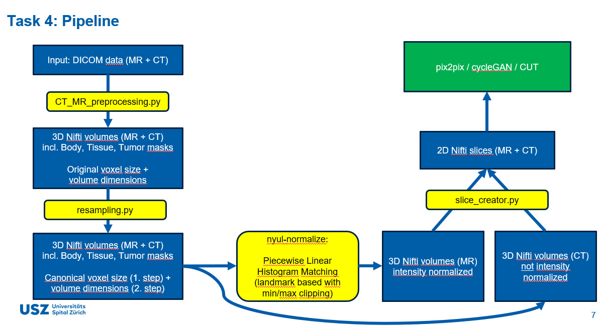

# fullbody-sCT

This repo is a collection of sub-projects that require separate environments. Go into the respective folder to find instructions on usage of the respective sub-project.

Todo 
1. MHA to DICOM or Nifti (perhaps CT_MR_preprocessing.py could be ingnored)
    - MHA to DICOM: 
    - MHA to Nifti: Flavian via MHA_NIFTI_preprocessing.py
2. DICOM files into the folderstructure needed for the script (reprocessing-readme) or anotherway to bring it in CT_MR_preprocessing.py or resampling.py (if directly MHA to Nifti) 
3. In CT_MR_preprocessing.py Masks are constructed, I think we actually don't need that, we should be able to disable it
4. Check if it can run (maybe we also need to create an excel file that correctly specifies the train/test split)



USZ Fullbody SCT data is stored in `/local/scratch/datasets/FullbodySCT/USZ_Data` as dcm = DICOM. 
Note: the data in `initial data` should look like this:
```text
  /Pat015_2_SB_KIDr_1a
    /Plan
      /CT
        CT1.3.12.2.1107.5.1.4.65204.30000020073107453621100001809.dcm
        ...
      /MR
        MR2.16.840.1.114493.1.4.228.3.20200731123826703.dcm
        ...
      RTPLAN2.16.840.1.114493.1.4.228.3.20210305171100260.dcm
      RTSTRUCT2.16.840.1.114493.1.4.228.3.20210305171100267.dcm
      RTDOSE2.16.840.1.114493.1.4.228.3.20210305171100273.dcm
    /CT_reg
      CT1.3.12.2.1107.5.1.4.65204.30000020073107453621100001936.dcm
      ...
  /Pat001_1_SB_LIV_1a
    	...
  /Pat002_2_SB_ABD_1a
    	...
```

## SynthRAD2023 Task 1 dataset
 Data from three Dutch university medical centers

Below is the expected structure for Task 1 as provided (brain and pelvis cohorts), with per-patient folders and an overview directory. Each patient folder contains MR/CT volumes and a mask; the overview contains summary spreadsheets and preview images.

#### Brain
The collected MRIs of centers B and C were acquired with a Gadolinium contrast agent, while the MRIs selected from center A were acquired without contrast. 
#### Pelvis
The Pelvis dataset consists of two-third of the T1 weighted spoiled gradient echo sequence,and one-third of the T2-weighted fast spin echo , with no contrast on MRI and CT.
Machine specifics can be found in the tables of the Dataset papers. 

Preprocessing steps:
- **Convert** DICOM to compressed nifti (.nii.gz.)
- **Resampling**;  To have a uniform voxel grid, all images of an anatomical region were resampled to the same voxel spacing. A 1×1×1mm3 grid was chosen for the brain, while a coarser grid of 1×1×2.5mm3 was selected for the pelvis.
- **Image registration**; image registration with Elastix. 
- **Anonymization**; defacing was performed utilizing the contours of the eyes and removing voxels inferior and anterior to the eyes.
- **Patient outline segmentation**; binary mask of the patient outline with some air. 
- **Cropping**; all images were cropped to the bounding box of the patient outline, using a margin of 20 voxels.


```text
Task 1/
    brain/
        1BXXXX/
            mr.nii.gz
            ct.nii.gz
            mask.nii.gz
        ...
        overview/
            1_brain_train.xlsx
            1BXXXX_train.png
            ...

    pelvis/
        1PXXXX/
            mr.nii.gz
            ct.nii.gz
            mask.nii.gz
        ...
        overview/
            1_pelvis_train.xlsx
            1PXXXX_train.png
            ...
```

Notes
- 1BXXXX and 1PXXXX denote anonymized patient identifiers for brain and pelvis, respectively.
- mr.nii.gz / ct.nii.gz are co-registered preprocessed volumes; mask.nii.gz is the corresponding patient/body or task mask as provided.


### Task 1 case counts (per center)

Brain

| Split       | Center A | Center B | Center C | Total |
|-------------|----------|----------|----------|-------|
| Train       | 60       | 60       | 60       | 180   |
| Validation  | 10       | 10       | 10       | 30    |
| Test        | 20       | 20       | 20       | 60    |

Pelvis

| Split       | Center A | Center B | Center C | Total |
|-------------|----------|----------|----------|-------|
| Train       | 120      | 0        | 60       | 180   |
| Validation  | 20       | 0        | 10       | 30    |
| Test        | 40       | 0        | 20       | 60    |


## SynthRAD2025 Task 1 dataset

Data from five European university  medical centers [UMC Groningen,UMC Utrecht,Radboud UMC (Netherlands), LMU University Hospital Munich, and University Hospital of Cologne (Germany)].  Data-providing centers are abbreviated using the letters A to E, only A, B, C and D provided data for Task1. 

 890 are MRI-CT

 the dataset was split into a training, validation, and test set, aiming at a split of 65/10/25%.

 The data provided by Center C was acquired for diagnostic purposes with a smaller FOV and different immobilization devices, which makes this dataset specifically challenging for sCT generation.

 
### Task 1 compact overview (HN/TH/AB across centers A–D)

| Anatomy | Split       | A  | B  | C  | D  | All |
|---------|-------------|----|----|----|----|-----|
| HN      | Train       | 91 | 0  | 65 | 65 | 221 |
| HN      | Validation  | 14 | 0  | 10 | 10 | 34  |
| HN      | Test        | 35 | 0  | 25 | 25 | 85  |
| TH      | Train       | 91 | 91 | 0  | 0  | 182 |
| TH      | Validation  | 14 | 14 | 0  | 0  | 28  |
| TH      | Test        | 35 | 35 | 0  | 0  | 70  |
| AB      | Train       | 65 | 91 | 19 | 0  | 175 |
| AB      | Validation  | 10 | 14 | 3  | 0  | 27  |
| AB      | Test        | 25 | 35 | 8  | 0  | 68  |

Quick totals by split

| Split       | HN  | TH  | AB  | Total |
|-------------|-----|-----|-----|-------|
| Train       | 221 | 182 | 175 | 578   |
| Validation  | 34  | 28  | 27  | 89    |
| Test        | 85  | 70  | 68  | 223   |
| Sum         | 340 | 280 | 270 | 890   |

Preprocessing steps:
- **Rigid registration**; MRI were registered to their CT using Elastix. 
- **Defacing**; Used Totalsegmentator 
- **Resampling**; all images were resampled with a consistent voxel spacing of 1×1×3mm. 
- **Outline segmentation**; histogram-based thresholding, followed by morphological erosion and dilation operations. The threshold value varied between centers’ anatomical regions and had to be manually tuned for some patients.
- **Cropping**; cropped to a 10 pixels-extended bounding box of patient outline. 
- **File conversion**; .mha
- **Deforming CT to MRI/CBCT**; performed to align the modalities better for

During the visual control, the following observations were made: (1) In some cases, the position of the arms varied between MR/CBCT and CT acquisitions. (2) Image artifacts, such as those caused by metal implants, were present in a limited number of cases. (3) Depending on the definition of anatomical regions and imaging protocols in each center, some thoracic cases are included in the abdominal dataset and vice versa. (4) Variations among patients affected the automatic thresholding process for the definition of the body mask, resulting in the possible inclusion of couch structures or the exclusion of lung regions. As a result of the automatic thresholding and the varying thresholds used, the final dilation margins around the patient outline are different among patients and dataset. (5) The 1HN subset of center C included MRIs with a limited field of view, making rigid and deformable
 registration particularly challenging. These cases may be challenging for sCT generation. (6) Patient outline
 masks in subsets 1AB and 1TH of center B were cropped in the inferior-superior direction due to vary
ing MRI intensities and frequent artifacts at the edge of the FOV. In some cases, the cropped mask still
 includes artifacts, or the cropping might remove regular slices.

 /local/scratch/datasets/FullbodySCT/SynthRAD2025 
 ```text
    /excel

    /synthRAD2025_Task1_Train
       /Task1
            /AB
                /1AB[A-E][0-9][0-9][0-9]
                    ct.mha
                    mask.mha
                    mr.mha
                /...
                /overviews
                    1ABXXXX_overview.png
                    ...
                    1_AB_train_parameters.xlsx
            /HN
                /1HN[A-E][0-9][0-9][0-9]
                    ct.mha
                    mask.mha
                    mr.mha
                /...
                /overviews
                    1HNXXXX_overview.png
                    ...
                    1_HN_train_parameters.xlsx
            /TH
                /1TH[A-E][0-9][0-9][0-9]
                    ct.mha
                    mask.mha
                    mr.mha
                /...
                /overviews
                    1THXXXX_overview.png
                    ...
                    1_TH_train_parameters.xlsx   

    /synthRAD2025_Task1_Train_Nifti
        /excel
            data_CT_MR_TEMP_second_paper.xlsx
        /nifti
            1ABA005
                1ABA005_3D_body.nii
                1ABA005_3D_CT_air_overwrite.nii  
                3D_mask_body.nii
            ...
            1THB226
                1THB226_3D_body.nii
                1THB226_3D_CT_air_overwrite.nii
                3D_mask_body.nii

    /synthRAD2025_Task1_Val_Input
        /Task1
            /AB
                /1AB[A-E][0-9][0-9][0-9]
                    mask.mha
                    mr.mha
                /...
                /overviews
                    1ABXXXX_overview.png
                    ...
                    1_AB_val_parameters.xlsx
            /HN
                /1HN[A-E][0-9][0-9][0-9]
                    mask.mha
                    mr.mha
                /...
                /overviews
                    1HNXXXX_overview.png
                    ...
                    1_HN_val_parameters.xlsx
            /TH
                /1TH[A-E][0-9][0-9][0-9]
                    mask.mha
                    mr.mha
                /...
                /overviews
                    1THXXXX_overview.png
                    ...
                    1_TH_val_parameters.xlsx
```

