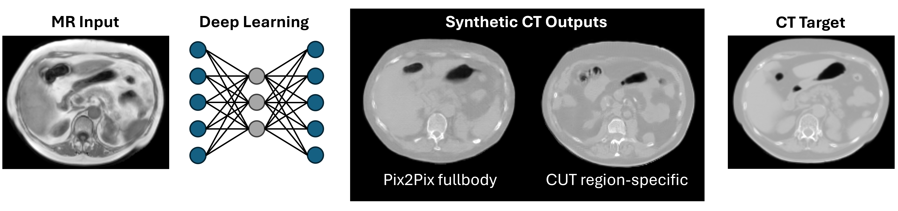

# fullbody-sCT

A research framework for **fullbody synthetic CT (sCT) generation from MRI**, investigating how modeling choices and data processing decisions affect image quality. The codebase supports end-to-end experiments from raw data ingestion through training, inference, and evaluation.



## Research Objectives, Experiments & Pipeline Overview

Three controlled experiments were conducted:

| # | Question | Approach |
|---|----------|----------|
| 1 | How do **region-specific models** compare to a **single fullbody model**? | Train and evaluate models on anatomical subsets (Brain, Head & Neck, Thorax, Abdomen, Pelvis) vs. combined fullbody data |
| 2 | How does **MR input normalization** affect sCT quality? | Compare four normalization strategies: baseline (min-max), per-file p99, Nyul histogram, and n-peaks |
| 3 | How do **alternative architectures** compare? | Benchmark pix2pix, to a SwinV2-UNet and ResNet generator |


## Repository Structure

```
fullbody-sCT/
├── pipeline/               # End-to-end pipeline orchestration + usage examples
├── preprocessing/          # Data conversion, resampling, normalization, slice creation
├── postprocessing/         # Volume reconstruction and intensity mapping
├── training/               # pix2pix, CycleGAN, and Swin V2 UNet training
├── training_cut/           # CUT (Contrastive Unpaired Translation) training
├── analysis/               # Notebooks and scripts for analysis, plots, results tables
├── synthrad_submission/    # Docker containerization for SynthRAD 2025 submission
└── environment.yml         # Conda environment for the full pipeline
```

## Pipeline

The full pipeline is orchestrated by `pipeline/run_pipeline.py` via sequentially numbered steps:

| Step(s) | Stage | Description |
|---------|-------|-------------|
| 10 | Convert | MHA → NIfTI format conversion |
| 12 | Body masks | Extract body masks from CT |
| 13 | Segmentation | Multi-organ segmentation via TotalSegmentator |
| 20 | Resampling | Standardize voxel spacing across patients |
| 21 | Split | Create train / val / test manifests |
| 22 | Resample masks | Align segmentation masks to resampled space |
| 30 | Normalization | Apply selected normalization (baseline / p99 / Nyul / n-peaks) |
| 40 | Slices | Convert 3D volumes to 2D axial slices |
| 50 | Materialize | Write train/val/test folder structure to disk |
| 60 | Pix2pix pairing | Concatenate MR and CT slices into paired A\|B images |
| 70 | Body region subsets | Create per-region (AB / HN / TH / …) dataset subsets |
| 80 | Training | Train selected GAN model |
| 90 | Inference | Run inference on test slices |
| 100 | Reconstruction | Reconstruct 3D sCT volumes from 2D predictions |
| 110 | Metrics | Compute per-volume MAE, RMSE, SSIM |
| 130–150 | DVH evaluation | Organ dose metrics for radiotherapy evaluation |

Note on reproducibility: hyperparameters in the code have been set to the optimal values and the applied train/validation/test split can be found in `preprocessing/preprocessing_synthrad/splits_manifest.csv`.

## Folder Details

### `pipeline/`
Contains `run_pipeline.py`, the single entry point for running any combination of pipeline steps. Configuration is passed via CLI flags (normalization method, GAN architecture, epochs, batch size, body region filter). Folder also contains examples of configurations for different experiments.

### `preprocessing/`
Numbered scripts (`10`–`70`) implementing each preprocessing step. A complete usage guide is at `preprocessing/preprocessing_synthrad/USAGE_GUIDE.md`.

**Normalization methods:**
- `31` — Baseline min-max normalization
- `32` — Per-file 99th-percentile normalization
- `33` — Nyul histogram normalization
- `34` — N-peaks intensity normalization (with LIC variants)

Some preprocessing code was based on [medical-physics-usz/synthetic_CT_generation](https://github.com/medical-physics-usz/synthetic_CT_generation) and [medical-physics-usz/NPeaks](https://github.com/medical-physics-usz/NPeaks).

### `training/`
PyTorch training code adapted from [junyanz/pytorch-CycleGAN-and-pix2pix](https://github.com/junyanz/pytorch-CycleGAN-and-pix2pix).

- `train.py` — Main training loop with DDP support; selects model via `--model` flag (`pix2pix` / `cycle_gan`)
- `train_pure_swinv2.py` — Training for the Swin V2 UNet generator without GAN setting (pure L1 loss)
- `test_synth.py` / `inference_synth.py` — Inference scripts used in the pipeline
- `models/` — Model implementations (pix2pix, CycleGAN, Swin V2 UNet, networks)
- `dvh_eval/` — Pipeline for DVH-based dose evaluation (incl. transform NIfTI to DICOM)

### `training_cut/`
Separate implementation of the **CUT** (Contrastive Unpaired Translation) architecture, memory-efficient for unpaired MR→CT translation. Adapted from [taesungp/contrastive-unpaired-translation](https://github.com/taesungp/contrastive-unpaired-translation).

### `postprocessing/`
- `81sct_volume_reconstructor.py` — Reconstruct 3D sCT volumes from 2D test slices, restoring original patient dimensions
- `82resampled_to_original.py` — Reverse resampling to original patient space
- `110compute_volume_metrics.py` — Per-volume MAE, RMSE, SSIM computation

### `analysis/`
Jupyter notebooks and scripts used for additional analysis, plotting, and results tables. Includes intensity distribution analysis, resampling option comparisons, and per-experiment result aggregation.

### `synthrad_submission/`
Docker container wrapping the trained model for submission to the [SynthRAD 2025 Grand Challenge](https://synthrad2025.grand-challenge.org/). See `synthrad_submission/README.md` for build and submission instructions.

## Environment

A single Conda environment covers the full pipeline:

```bash
conda env create -f environment.yml
conda activate <env-name>
```

For the `synthrad_submission` Docker container, see `synthrad_submission/requirements.txt`.

## Quick Start

Preliminary: Download data from [SynthRAD 2025](https://zenodo.org/records/15373853) and [SynthRAD 2023](https://synthrad2023.grand-challenge.org/) (needs login creation) and store into `<data-root>`.  

```bash
# Run the full pipeline (example: pix2pix, baseline normalization, abdomen region)
python run_pipeline.py \
  --synthrad-data-root <data-root> \
  --subfolder-name <name> \
  --body-part-filter AB \
  --preprocessing-method 31baseline \
  --method pix2pix \
  --epochs 50 \
  --batch-size 1 \
  --start 10
```

See `preprocessing/preprocessing_synthrad/USAGE_GUIDE.md` for detailed per-step instructions.

## Report

Project report: *link to be added when published*